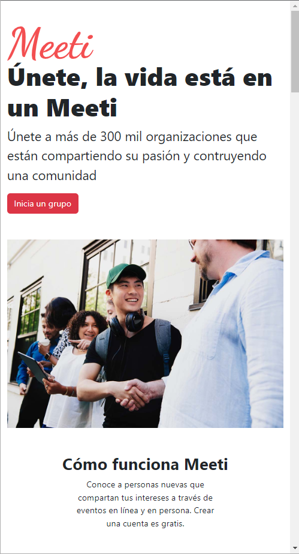
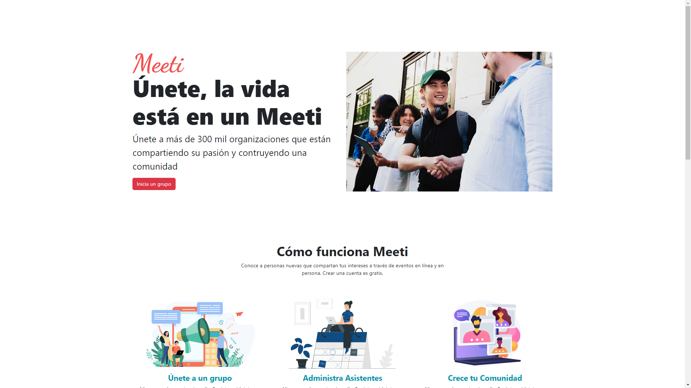

# Clon de meeti

Clon de Meeti con HTML5, Bootstrap y SCSS

Este proyecto es un clon de Meeti, una aplicación de planificación de eventos en línea, desarrollado utilizando tecnologías web modernas como HTML5, Bootstrap y SCSS. Es completamente responsive, lo que significa que se adapta perfectamente a dispositivos móviles y de escritorio para brindar una experiencia de usuario óptima en cualquier pantalla. 

## Tabla de contenidos

- [Clon de meeti](#clon-de-meeti)
  - [Tabla de contenidos](#tabla-de-contenidos)
  - [Vista Previa](#vista-previa)
    - [Screenshot](#screenshot)
    - [Link](#link)
  - [Mi Proceso](#mi-proceso)
    - [Construido con:](#construido-con)
  - [Autor](#autor)

## Vista Previa

### Screenshot
Mobile screenshot

Desktop screenshot

### Link

- Live Site URL: [https://vmnunez.github.io/clon-meeti-bootstrap/)

## Mi Proceso

### Construido con:

- HTML5 
- SCSS
- Bootstrap
- Mobile-first workflow

## Autor
Víctor Manuel Núñez Pradas